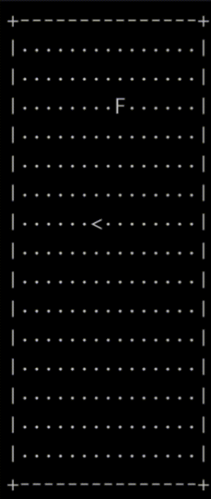

<p align="center">
  
</p>

# Snake SNN Agent

This project implements a Snake game agent powered by a Spiking Neural Network (BrainSNN). The agent uses latency-based coding for decision making and can evolve through training.

## Features

- **Spiking Neural Network Brain**: Uses the BrainSNN implementation with plasticity mechanisms
- **Latency Coding**: Makes decisions based on which output neuron spikes first
- **Vision System**: Uses ray casting to detect walls, food, and body segments
- **Evolvable Architecture**: Network can grow neurons and connections through plasticity
- **Evolutionary Training**: Population-based training to evolve better agents

## Requirements

- Python 3.8+
- NumPy
- Matplotlib (for plotting training progress)

Install requirements:

```bash
pip install -r requirements.txt
```

## Usage

### Training

Train a new agent with evolutionary techniques:

```bash
python train_snake_snn.py --mode train --generations 50 --population 20 --render
```

Options:
- `--generations`: Number of generations to train (default: 50)
- `--population`: Population size (default: 10)
- `--render`: Enable visualization of the best agent during training

The training process will:
1. Create a population of agents with varied parameters
2. Evaluate each agent's performance on multiple Snake game episodes
3. Select the best-performing agents for reproduction
4. Create a new population with mutation
5. Repeat for the specified number of generations

The best agent will be saved to `best_agent.pkl`.

### Testing

Test a trained agent:

```bash
python train_snake_snn.py --mode test --agent best_agent.pkl
```

### Manual Play

Play the Snake game manually using arrow keys:

```bash
python train_snake_snn.py --mode manual
```

## SNN Agent Architecture

### Input Layer (29 neurons)
- **Vision Rays (24 neurons)**: 8 rays × 3 values (distance to wall, food, body)
- **Direction (4 neurons)**: One-hot encoding of current direction
- **Danger (3 neurons)**: Immediate danger in forward, right, and left directions
- **Food Direction (2 neurons)**: Normalized vector pointing to food

### Hidden Layer (50-200 neurons)
- Starts with 50 neurons
- Can grow up to 200 neurons through plasticity

### Output Layer (4 neurons)
- UP, RIGHT, DOWN, LEFT actions
- Uses latency coding (first neuron to spike wins)

## How It Works

1. **Sensory Processing**:
   - Cast vision rays in 8 directions to detect objects
   - Encode current direction and immediate danger signals
   - Convert state information to spike probabilities

2. **Decision Making**:
   - Run the SNN for multiple time steps
   - Record when each output neuron first spikes
   - Choose action based on earliest spike (latency coding)

3. **Learning**:
   - Apply plasticity after receiving positive rewards
   - Form new connections between active hidden neurons
   - Potentially grow new neurons

4. **Evolution**:
   - Select agents with highest fitness (score + survival time)
   - Create new generation through mutation of parameters
   - Gradually improve performance over generations

## Files

- `brain_snn_numpy.py`: The core SNN implementation
- `snake_environment.py`: Snake game environment
- `snake_agent.py`: Agent that interfaces between the environment and SNN
- `train_snake_snn.py`: Training and evaluation code

## Customization

You can customize various parameters in the `SnakeAgent` class:
- Number of hidden neurons
- Maximum number of hidden neurons
- Latency window for decision making
- Connection probability
- Plasticity threshold
- Neuron and connection growth rates 
